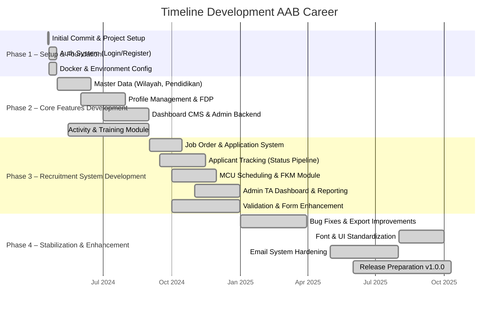

# Analisis Reverse Engineering: AAB Career (Recruitment Management System)

> Dianalisis pada: 14 Mei 2026
> Repository: D:\laragon\www\aab-career
> Analis: Claude Code (Reverse Engineering Mode)

---

## 1. Deskripsi Proyek

AAB Career adalah sebuah sistem manajemen rekrutmen (Applicant Tracking System) berbasis web yang dibangun untuk mengelola seluruh siklus hidup perekrutan karyawan, mulai dari publikasi lowongan hingga konfirmasi manfaat dan medical check-up. Sistem ini terdiri dari dua komponen utama: backend berbasis Laravel 11 yang menyediakan API dan CMS administrasi, serta frontend dashboard berbasis Next.js 14 yang menjadi antarmuka bagi calon pelamar dan tim TA (Talent Acquisition).

Domain bisnis yang dilayani mencakup manajemen lowongan pekerjaan (*Job Order*), pendaftaran dan pelacakan lamaran, pengelolaan profil pelamar secara komprehensif (meliputi data pribadi, pendidikan, pengalaman kerja, organisasi, keluarga, dan lainnya), penjadwalan *Medical Check Up* (MCU), serta konfirmasi manfaat kerja (*FKM*). Sistem ini menggunakan autentikasi berbasis cookie Laravel Sanctum dengan tiga *guard* berbeda: `applicant` untuk pelamar, `admin-ta` untuk tim rekrutmen, dan `admin` untuk pengelolaan CMS.

Dari struktur *database* yang terdiri dari lebih dari 120 *migrations* dan 63 *model*, dapat disimpulkan bahwa sistem ini dirancang untuk menangani data pelamar yang sangat detail dan terstruktur. Hal ini mendukung kebutuhan organisasi dengan proses rekrutmen yang kompleks dan memerlukan validasi data yang ketat. Sistem ini juga dilengkapi dengan fitur *reporting*, *export* data ke Excel, dan manajemen master data seperti wilayah Indonesia, universitas, fakultas, jurusan, serta struktur organisasi perusahaan (direktorat, divisi, departemen, cabang).

---

## 2. Permasalahan (Problem Statement)

1. **Proses Rekrutmen Manual yang Tidak Efisien** — Pengelolaan lowongan dan lamaran masih dilakukan secara manual melalui email atau spreadsheet, menyebabkan lamaran tercecer, sulit dilacak, dan waktu respons yang lambat terhadap calon pelamar.

2. **Tidak Ada Transparansi Status Lamaran** — Pelamar tidak memiliki visibilitas terhadap tahapan proses seleksi mereka, yang mengakibatkan ketidakpastian dan pengalaman kandidat yang buruk.

3. **Data Pelamar Tersebar dan Tidak Terstandarisasi** — Informasi pelamar dikumpulkan dalam berbagai format dokumen, sehingga sulit untuk dilakukan pembandingan, *screening*, dan analisis kompetensi secara sistematis.

4. **Manajemen Jadwal MCU yang Tidak Terintegrasi** — Penjadwalan medical check-up dilakukan terpisah dari sistem rekrutmen, menyebabkan kesulitan dalam koordinasi antara tim TA, pelamar, dan penyedia layanan kesehatan.

5. **Kesulitan dalam Pelaporan dan Analisis Data Rekrutmen** — Tim manajemen kesulitan memperoleh laporan real-time mengenai *pipeline* rekrutmen, jumlah pelamar per posisi, dan metrik kinerja TA karena data tidak terpusat.

6. **Kebutuhan Validasi Data yang Ketat** — Proses rekrutmen memerlukan verifikasi data pribadi, pendidikan, dan riwayat pekerjaan yang komprehensif untuk memenuhi standar kepatuhan dan kualitas SDM.

---

## 3. Solusi yang Dibangun

| Permasalahan | Solusi / Fitur yang Dibangun |
|---|---|
| Proses rekrutmen manual | Sistem *Job Order* dengan CRUD lowongan, publikasi, dan manajemen status lowongan; sistem lamaran pekerjaan (*Application*) dengan alur tahapan seleksi (*ApplicationStageStatus*) |
| Tidak ada transparansi status | Dashboard pelamar untuk melacak status lamaran real-time; notifikasi dan riwayat perubahan status |
| Data pelamar tersebar | Form Data Pribadi (FDP) terstruktur dengan 15+ tabel relasional (pendidikan, pengalaman, keluarga, organisasi, keterampilan, dll); validasi berbasis Zod di frontend dan Laravel di backend |
| Manajemen MCU tidak terintegrasi | Modul *MedicalSchedule* dan *ApplicantMedicalSchedule* untuk penjadwalan MCU berbasis tanggal yang dapat dipilih pelamar |
| Kesulitan pelaporan | Fitur *export* data pelamar ke Excel, dashboard admin TA dengan grafik dan ringkasan lowongan, serta filter dan pencarian lanjutan |
| Validasi data yang ketat | Sistem *Capability-Based Authorization*, validasi multi-panel pada FDP, pengecekan kelengkapan profil, dan fitur *review* aplikasi oleh admin TA |

---

## 4. Tujuan Proyek

1. **Digitalisasi Seluruh Siklus Rekrutmen** — Menggantikan proses manual dengan sistem terintegrasi yang mencakup publikasi lowongan, penerimaan lamaran, seleksi, MCU, hingga konfirmasi manfaat (FKM).

2. **Peningkatan Transparansi dan Pengalaman Pelamar** — Memberikan visibilitas penuh kepada pelamar terhadap status lamaran mereka melalui dashboard personal yang responsif dan informatif.

3. **Efisiensi Administrasi Tim TA** — Mempermudah tim rekrutmen dalam mengelola lowongan, menyaring pelamar, menjadwalkan MCU, dan menghasilkan laporan melalui satu platform terpusat.

4. **Integrasi Data Master Nasional** — Menyediakan basis data referensi yang akurat untuk wilayah Indonesia, institusi pendidikan, dan struktur organisasi perusahaan untuk memastikan konsistensi data.

5. **Keamanan dan Kepatuhan Data** — Menerapkan autentikasi berbasis Sanctum dengan cookie, kontrol akses berbasis kemampuan (*capability*), serta fitur penghapusan akun dan riwayat login untuk memenuhi kebutuhan privasi data.

---

## 5. Tech Stack

### Frontend
| Teknologi | Versi | Peran |
|---|---|---|
| Next.js | 14.1.0 | Framework React untuk frontend dashboard (Pages Router) |
| React | ^18 | Library UI untuk komponen antarmuka |
| Redux Toolkit | ^2.2.1 | State management global |
| RTK Query | ^2.2.1 | Data fetching dan caching API |
| TanStack React Query | ^5.32.0 | Server state management tambahan |
| TanStack React Table | ^8.17.3 | Tabel data interaktif dengan filter/sort |
| Sass | ^1.70.0 | Preprocessor CSS |
| styled-components | ^6.1.13 | CSS-in-JS untuk styling komponen |
| Axios | ^1.6.7 | HTTP client untuk komunikasi dengan backend |
| React Hook Form | ^7.51.3 | Manajemen form dengan validasi |
| Zod | ^3.24.2 | Schema validation |
| Framer Motion | ^11.0.6 | Animasi UI |
| Recharts | ^2.15.1 | Grafik dan visualisasi data |
| React-PDF | ^9.1.0 | Viewer dan generator PDF |

### Backend
| Teknologi | Versi | Peran |
|---|---|---|
| Laravel | ^11.31 | Framework PHP monolitik |
| PHP | ^8.2 | Bahasa pemrograman server |
| Laravel Sanctum | ^4.0 | Autentikasi berbasis cookie/token API |
| Inertia.js | ^2.0 (server) / ^1.0.11 (client) | Rendering SPA tanpa API terpisah untuk CMS |
| React | ^18.2.0 | UI untuk bagian Inertia.js dashboard di backend |
| Vite | ^4.4.9 | Build tool untuk asset frontend |
| Bootstrap | ^4.6.2 | CSS framework untuk template AdminLTE |
| maatwebsite/excel | ^3.1 | Export dan import file Excel |
| Intervention Image | ^3.10 | Manipulasi gambar |
| Spatie Google Calendar | ^3.8 | Integrasi kalender Google |
| Spatie Image Optimizer | ^1.8 | Optimasi gambar otomatis |
| laravolt/avatar | ^6.0 | Generator avatar inisial |

### Database & Storage
| Teknologi | Versi | Peran |
|---|---|---|
| MySQL | — (via Laravel config) | Database utama relasional |
| Redis | — (opsional, via Laravel) | Cache dan queue |
| Local Filesystem | — | Penyimpanan file private dan public melalui Laravel Storage |

### DevOps & Tooling
| Teknologi | Versi | Peran |
|---|---|---|
| Docker | — | Containerisasi stack aplikasi |
| nginx | — | Web server dan reverse proxy |
| Traefik | — | Reverse proxy dan load balancer untuk environment dev tonjoo |
| PHPUnit | ^11.0.1 | Unit dan feature testing |
| Laravel Pint | ^1.13 | Code style formatting |
| Laravel Debugbar | ^3.14 | Debug toolbar untuk development |

---

## 6. Timeline Development (Gantt Chart)

> Direkonstruksi dari git commit history.
> Rentang waktu proyek: **18 Apr 2024** s/d **10 Okt 2025**

### Ringkasan Fase Development

| Fase | Nama Fase | Periode | Fitur Utama | Jumlah Commit |
|---|---|---|---|---|
| Phase 1 | Setup & Foundation | 18 Apr 2024 – 30 Apr 2024 | Inisialisasi repo, auth dasar, konfigurasi Docker | 42 |
| Phase 2 | Core Features Development | 1 Mei 2024 – 31 Agu 2024 | Master data, profil pelamar, aktivitas, pelatihan, dashboard CMS | 319 |
| Phase 3 | Recruitment System Development | 1 Sep 2024 – 31 Des 2024 | Job order, lamaran, tracking status, MCU, FKM, reporting, validasi | 703 |
| Phase 4 | Stabilization & Enhancement | 1 Jan 2025 – 10 Okt 2025 | Export Excel, perbaikan bug, standardisasi font, pengerasan email, release v1.0.0 | 290 |

---

## 7. Catatan Analis

1. **Arsitektur Plugin System Mirip WordPress** — Backend menggunakan sistem *hook* custom melalui `Eventy` yang memungkinkan registrasi *route*, *capability*, dan menu secara dinamis melalui *boot providers*. Pola ini memberikan fleksibilitas tinggi namun memerlukan pemahaman mendalam bagi pengembang baru karena alur eksekusi tidak terlihat secara eksplisit di file *route* konvensional.

2. **Multi-Interface Frontend dalam Satu Backend** — Laravel backend tidak hanya menyediakan API, tetapi juga men-*serve* tiga antarmuka berbeda: CMS Admin (Blade + AdminLTE), Dashboard Inertia (React), dan Frontend Web (React). Hal ini menambah kompleksitas konfigurasi Vite dan manajemen *asset*, meskipun memudahkan *deployment* monolitik.

3. **Potensi Technical Debt pada Frontend Dashboard** — Frontend dashboard menggunakan kombinasi Redux Toolkit, RTK Query, dan TanStack React Query secara bersamaan, yang mengindikasikan evolusi teknologi selama pengembangan. Tidak adanya konfigurasi *testing* (lint, test, format) di frontend juga menjadi area yang perlu diperhatikan untuk menjaga kualitas kode jangka panjang.

---

*Dokumen ini dihasilkan secara otomatis melalui reverse engineering repository. Validasi manual oleh System Analyst direkomendasikan sebelum digunakan sebagai dokumen resmi.*
