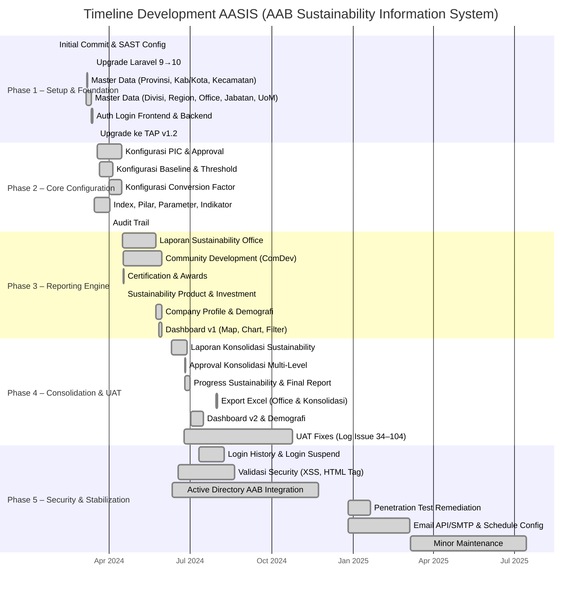

# Analisis Reverse Engineering: AASIS — AAB Sustainability Information System

> Dianalisis pada: 14 Mei 2026
> Repository: D:\laragon\www\aasis-aab (Tonjoo Admin Panel v1.2)
> Analis: Claude Code (Reverse Engineering Mode)

---

## 1. Deskripsi Proyek

AASIS (AAB Sustainability Information System) adalah sistem informasi berbasis web yang dibangun di atas framework Laravel 10 untuk mendukung pelaporan dan pengelolaan sustainability (keberlanjutan) di lingkungan korporasi AAB. Sistem ini memiliki dua antarmuka utama: **Frontend** yang diakses oleh pengguna internal perusahaan untuk menginput data sustainability per kantor/instalasi, dan **Backend/CMS** yang digunakan oleh administrator untuk mengelola konfigurasi laporan, master data, pengguna, dan konten sistem.

Domain bisnis yang dilayani mencakup berbagai aspek sustainability, di antaranya: pengurangan emisi gas rumah kaca (GHG Reduction), pencampuran energi terbarukan (Renewable Energy Mix), penggunaan air (Water Withdrawal), pengalihan limbah (Waste Diverted), tingkat kecelakaan kerja (Lost Time Injury Rate), serta community development melalui pilar-pilar pendidikan, kewirausahaan, kesehatan, dan lingkungan. Sistem mendukung hierarki organisasi multi-level mulai dari kantor/instalasi, region, divisi, hingga tingkat korporat (konsolidasi).

Pengguna sistem terdiri dari PIC (Person in Charge) laporan per kantor, approver tingkat manajer cabang, vice president, direktur, hingga president director, serta administrator sistem. Sistem juga terintegrasi dengan Active Directory Internal AAB untuk autentikasi SSO (Single Sign-On), dan dilengkapi dengan fitur audit trail, login history, login suspend, serta pengiriman notifikasi email melalui API atau SMTP lokal.

---

## 2. Permasalahan (Problem Statement)

1. **Tidak Terpusatnya Data Sustainability** — Data sustainability tersebar di berbagai kantor/instalasi AAB tanpa sistem terpadu, menyebabkan kesulitan dalam mengumpulkan, memvalidasi, dan mengonsolidasikan data ke tingkat korporat secara akurat dan tepat waktu.

2. **Kompleksitas Alur Persetujuan Multi-Level** — Laporan sustainability memerlukan persetujuan bertingkat (Branch Manager → VP → Director → President Director) dengan mekanisme yang berbeda-beda per region, sehingga diperlukan sistem yang dapat mengkonfigurasi alur approval secara fleksibel.

3. **Kebutuhan Perhitungan Konsolidasi yang Kompleks** — Data dari puluhan kantor/instalasi harus dikonsolidasikan dengan rumus perhitungan spesifik per indikator (misal: GHG Reduction, Renewable Energy Mix, LTIR) yang melibatkan conversion factor, baseline, threshold, dan adjustment, yang sulit dilakukan secara manual.

4. **Keterbatasan Visibilitas Dashboard Real-Time** — Manajemen membutuhkan dashboard interaktif yang dapat menampilkan progress sustainability, global performance, dan sebaran community development secara real-time dengan visualisasi chart dan peta (map).

5. **Risiko Keamanan dan Integritas Data** — Sistem menangani data sensitif perusahaan yang memerlukan proteksi terhadap serangan XSS, validasi tipe file upload, serta mekanisme audit trail untuk melacak perubahan data.

6. **Ketergantungan pada Proses Manual dan Email** — Proses pengingat (reminder) pelaporan, notifikasi approval, dan distribusi laporan masih banyak dilakukan secara manual melalui email, sehingga memerlukan otomatisasi terjadwal (scheduled task).

---

## 3. Solusi yang Dibangun

| Permasalahan | Solusi / Fitur yang Dibangun |
|---|---|
| Tidak Terpusatnya Data Sustainability | Modul **Laporan Sustainability Office** untuk input data per kantor/instalasi, dan **Laporan Sustainability Konsolidasi** untuk penggabungan data korporat |
| Kompleksitas Alur Persetujuan Multi-Level | Modul **Konfigurasi Approval** dengan role-based approval (Branch Manager, VP, Director, President Director) dan **Konfigurasi PIC** per office/region |
| Kebutuhan Perhitungan Konsolidasi yang Kompleks | Modul **Konfigurasi Baseline**, **Konfigurasi Threshold**, **Konfigurasi Conversion Factor**, dan **Konfigurasi Index** dengan perhitungan otomatis pada konsolidasi |
| Keterbatasan Visibilitas Dashboard Real-Time | **Dashboard Sustainability** dengan chart progress, quick analysis, global performance, peta sebaran community development, dan demografi company overview |
| Risiko Keamanan dan Integritas Data | Implementasi validasi XSS/HTML tags, file type upload validation, **Audit Trail**, **Login History**, **Login Suspend**, dan penetration test remediation |
| Ketergantungan pada Proses Manual dan Email | **Scheduled Task / Reminder**, **Job Queue** untuk pengiriman email notifikasi via API/SMTP, dan **Email Tester** |

---

## 4. Tujuan Proyek

1. **Sentralisasi Pelaporan Sustainability** — Menyediakan satu platform terpadu untuk pengumpulan, validasi, persetujuan, dan konsolidasi data sustainability dari seluruh kantor/instalasi AAB.

2. **Otomatisasi Perhitungan dan Konsolidasi** — Mengurangi kesalahan perhitungan manual melalui sistem yang secara otomatis menghitung index summary, adjustment, outlook, dan threshold berdasarkan konfigurasi yang telah ditetapkan.

3. **Peningkatan Visibilitas Manajemen** — Menyediakan dashboard interaktif dengan visualisasi chart, peta, dan laporan final report yang dapat diakses secara real-time oleh manajemen.

4. **Penguatan Keamanan dan Compliance** — Memenuhi standar keamanan aplikasi web melalui penetration test remediation, validasi input, kontrol akses berbasis role, dan audit trail.

5. **Efisiensi Proses Approval dan Notifikasi** — Mempercepat alur persetujuan laporan dengan sistem approval berjenjang dan notifikasi email otomatis melalui job queue.

---

## 5. Tech Stack

### Frontend
| Teknologi | Versi | Peran |
|---|---|---|
| React | ^18.2.0 | UI rendering pada beberapa halaman frontend via Inertia.js |
| Inertia.js (React) | ^1.0.11 | Memungkinkan rendering SPA tanpa membangun API terpisah |
| Bootstrap | ^4.6.2 | Framework CSS untuk styling komponen |
| jQuery | ^3.7.0 | Manipulasi DOM pada legacy AdminLTE components |
| Sass | ^1.56.2 | Preprocessor CSS untuk theme customization |
| Swiper | ^10.3.0 | Carousel/slider components |
| date-fns | ^2.30.0 | Utility formatting tanggal |

### Backend
| Teknologi | Versi | Peran |
|---|---|---|
| Laravel | ^10.10 | Framework PHP utama |
| PHP | ^8.1 | Runtime PHP |
| Inertia Laravel | ^0.6.9 | Adapter Inertia untuk Laravel |
| Livewire | — | Komponen dinamis (Alert, Export, Import) |
| Laravel Sanctum | ^3.3 | API token authentication |
| Laravel UI | ^4.4 | Scaffolding autentikasi |
| Maatwebsite Excel | ^3.1 | Export/import data Excel |
| Intervention Image | ^2.7 | Manipulasi gambar |
| Spatie Laravel Image Optimizer | ^1.7 | Optimasi gambar |
| Spatie Laravel Sluggable | ^3.4 | Generate slug otomatis |
| Mews Captcha | ^3.3 | Proteksi form dengan captcha |
| Rackbeat UI Avatars | ^1.1 | Generate avatar inisial pengguna |
| Rap2hpoutre Log Viewer | ^2.2 | Viewer log aplikasi |
| Ziggy | ^1.6 | Share named routes ke JavaScript |
| Doctrine DBAL | ^3.3 | Database abstraction layer |

### Database & Storage
| Teknologi | Versi | Peran |
|---|---|---|
| MySQL | — | Database utama (dikonfigurasi di .env) |
| Laravel File Storage | — | Penyimpanan file upload laporan dan attachment |
| Eksternal Storage Path | — | Path eksternal untuk log dan upload file |

### DevOps & Tooling
| Teknologi | Versi | Peran |
|---|---|---|
| Vite | ^4.4.9 | Module bundler dan dev server (menggantikan Laravel Mix) |
| Laravel Vite Plugin | ^0.7.8 | Integrasi Vite dengan Laravel |
| Grunt | ^1.6.1 | Task runner untuk generate SVG sprite |
| Grunt SVGStore | ^2.0.0 | Menggabungkan file SVG menjadi sprite |
| Patch Package | ^8.0.0 | Patch dependency node_modules |
| Laravel Pint | ^1.0 | Code style formatter |
| PHPUnit | ^10.1 | Unit dan feature testing |
| Laravel Debugbar | ^3.6 | Debugging toolbar untuk development |
| Snyk | — | Security scanning (terlihat dari commit history) |

---

## 6. Timeline Development (Gantt Chart)

> Direkonstruksi dari git commit history.
> Rentang waktu proyek: **01 Februari 2024** s/d **14 Juli 2025**

### Ringkasan Fase Development

| Fase | Nama Fase | Periode | Fitur Utama | Jumlah Commit |
|---|---|---|---|---|
| Phase 1 | Setup & Foundation | 01 Feb 2024 – 31 Mar 2024 | Initial commit, Laravel 9→10 upgrade, master data (provinsi, kabupaten, kecamatan, divisi, region, office, jabatan, UoM), autentikasi login frontend & backend, upgrade ke TAP v1.2 | 70 |
| Phase 2 | Core Configuration | 01 Apr 2024 – 30 Apr 2024 | Konfigurasi PIC, approval, baseline, threshold, conversion factor, index/pilar/parameter/indikator sustainability, audit trail | 57 |
| Phase 3 | Reporting Engine | 01 Mei 2024 – 31 Mei 2024 | Laporan sustainability office, community development (4 pilar), certification & awards, sustainability product/investment, company profile, dashboard v1 dengan map & chart | 218 |
| Phase 4 | Consolidation & UAT | 01 Jun 2024 – 31 Okt 2024 | Laporan konsolidasi, approval konsolidasi multi-level, progress sustainability, final report, export Excel, dashboard v2, demografi, penyesuaian UAT (log issue #34–#104) | 181 |
| Phase 5 | Security & Stabilization | 01 Nov 2024 – 14 Jul 2025 | Login history & suspend, validasi XSS/HTML tags, Active Directory AAB, penetration test remediation, email API/SMTP, schedule config, minor maintenance | 28 |

---

## 7. Catatan Analis

1. **Arsitektur CMS Custom Berbasis WordPress Pattern** — Sistem ini mengimplementasikan layer abstraksi CMS internal (`app/Api/`) yang sangat mirip dengan arsitektur WordPress, lengkap dengan sistem action/filter hook (`Eventy`), facades, dan service provider kustom. Meskipun fleksibel untuk ekstensi, pola ini menambah kompleksitas kognitif bagi developer Laravel yang tidak familiar dengan paradigma WordPress, dan berpotensi menjadi technical debt jika tidak didokumentasikan dengan baik.

2. **Dual Rendering Strategy yang Berpotensi Menimbulkan Inkonsistensi** — Aplikasi menggunakan dua pendekatan rendering secara bersamaan: Blade tradisional untuk sebagian besar backend dan beberapa frontend, serta Inertia.js + React untuk halaman-halaman tertentu di frontend. Pendekatan hibrida ini, ditambah dengan penggunaan jQuery dan Bootstrap 4 di sisi legacy, menimbulkan risiko inkonsistensi UI/UX dan meningkatkan beban maintenance jika tidak ada kebijakan yang jelas mengenai kapan harus menggunakan masing-masing teknologi.

3. **Kurangnya Cakupan Pengujian Otomatis** — Dari 582 file PHP yang ada di direktori `app/`, hanya terdapat 4 file pengujian di direktori `tests/` (ExampleTest, RoleCapabilityTest). Dengan kompleksitas bisnis yang tinggi (perhitungan konsolidasi, approval workflow, audit trail), kurangnya unit test dan feature test merupakan risiko signifikan terhadap stabilitas sistem, terutama mengingat jumlah revisi dan perbaikan yang sangat tinggi selama fase UAT.

---

*Dokumen ini dihasilkan secara otomatis melalui reverse engineering repository. Validasi manual oleh System Analyst direkomendasikan sebelum digunakan sebagai dokumen resmi.*
