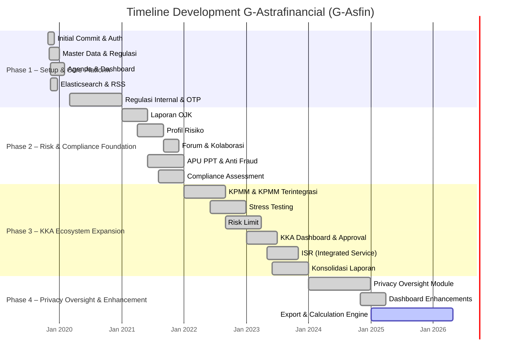

# Analisis Reverse Engineering: G-Astrafinancial (G-Asfin)

> Dianalisis pada: 15 Mei 2026
> Repository: D:\laragon\www\astra-afgoal
> Analis: Claude Code (Reverse Engineering Mode)

---

## 1. Deskripsi Proyek

**G-Astrafinancial (G-Asfin)** adalah aplikasi web berskala enterprise yang dikembangkan untuk **Sedaya Multi Investama (SMI)** atau **Astra Financial** beserta seluruh entitas anggota (subsidiaries) di bawah grup Astra Financial. Sistem ini dibangun menggunakan framework **Laravel 5.5** dengan arsitektur khusus bernama **'Aksara'** yang dikembangkan oleh Tonjoo Gagas Teknologi, mengadopsi pola **Microservices Modular**.

Aplikasi ini digunakan secara internal untuk melakukan dan menyampaikan laporan terkait audit, anti-pencucian uang (APU), pencegahan pendanaan terorisme (PPT), pembaruan regulasi dan risiko, penjadwalan acara RUPST (Rapat Umum Pemegang Saham Tahunan), forum diskusi, serta berbagai kebutuhan terkait tata kelola risiko konglomerasi keuangan. Sistem ini melayani multi-tenant di mana setiap entitas anggota (business unit) memiliki isolasi data dan alur approval yang terpisah, namun tetap dapat dikonsolidasikan di level SMI.

Secara arsitektural, sistem ini terdiri dari **49 modul** yang terorganisasi dalam direktori `aksara-modules/`, masing-masing memiliki domain bisnisnya sendiri seperti master data, pelaporan OJK, KPMM (Kewajiban Penyediaan Modal Minimum), profil risiko, stress testing, risk limit, dan Konglomerasi Keuangan Astra (KKA). Setiap modul memiliki migrasi database, model, controller, view, dan routing yang independen, memungkinkan pengembangan dan deployment modular.

---

## 2. Permasalahan (Problem Statement)

Berdasarkan analisis struktur domain, dokumen BRD, dan riwayat commit, berikut adalah permasalahan nyata yang melatarbelakangi pembangunan sistem ini:

1. **Fragmentasi Data antar Entitas Anggota** — Sebagai konglomerasi keuangan dengan berbagai entitas (bank, asuransi, pembiayaan, dll.), data risiko dan compliance tersebar di masing-masing entitas tanpa platform terpusat, menyebabkan sulitnya konsolidasi informasi di level grup.

2. **Kompleksitas Pelaporan Regulasi ke OJK** — Otoritas Jasa Keuangan (OJK) mewajibkan pelaporan berkala dengan format dan parameter yang ketat. Proses manual menyebabkan risiko keterlambatan dan inkonsistensi data antar periode.

3. **Koordinasi Risk Management yang Terintegrasi** — Tidak adanya visibilitas menyeluruh terhadap profil risiko, KPMM, stress testing, dan risk limit di seluruh entitas anggota, sehingga manajemen SMI kesulitan mengambil keputusan strategis berbasis data.

4. **Approval Workflow Multi-Level yang Kompleks** — Setiap laporan memerlukan approval bertingkat (Division Risk → Direktur Risk → Konsolidasi SMI) dengan mekanisme reminder, notifikasi, dan tracking status yang tidak terotomatisasi.

5. **Kepatuhan terhadap Regulasi APU dan PPT** — Kebutuhan untuk memastikan seluruh entitas mematuhi regulasi anti-pencucian uang dan pencegahan pendanaan terorisme melalui survei, penilaian, dan dokumentasi yang terstruktur.

6. **Keterlambatan dan Ketidakakuratan Laporan Konsolidasi** — Proses penggabungan laporan dari berbagai business unit masih banyak dilakukan secara manual melalui spreadsheet, meningkatkan risiko human error dan keterlambatan submit.

---

## 3. Solusi yang Dibangun

Sistem G-Asfin dirancang sebagai platform terintegrasi yang menjawab setiap permasalahan di atas melalui modul-modul spesifik:

| Permasalahan | Solusi / Fitur yang Dibangun |
|---|---|
| Fragmentasi Data antar Entitas | Arsitektur **Multi-Tenant** dengan modul `astra-financial-bu` dan `organisasi-asfin` untuk isolasi data per entitas anggota dalam satu platform. |
| Kompleksitas Pelaporan Regulasi OJK | Modul `laporan-ojk` dengan form kuesioner terstruktur, parameter audit, governance, compliance, dan tata kelola yang sesuai standar OJK. |
| Koordinasi Risk Management | Modul `integrated-risk-management`, `laporan-profil-risiko`, `laporan-stress-testing`, dan `laporan-risk-limit` dengan dashboard konsolidasi di level SMI. |
| Approval Workflow Multi-Level | Modul `approval-laporan-kka`, `approval-unit-bisnis`, dan fitur approval di setiap modul laporan dengan notifikasi email, tracking status, dan konfigurasi PIC. |
| Kepatuhan APU dan PPT | Modul `penilaian-apu-ppt-asfin`, `survei-anti-fraud`, dan `survey-kepatuhan-asfin` dengan upload dokumen, scoring, dan audit trail. |
| Keterlambatan Laporan Konsolidasi | Modul `laporan-kpmm`, `kpmm-terintegrasi-ea/eu/pub`, dan `kka` dengan engine perhitungan otomatis, export PDF/Excel/DOC, dan konsolidasi real-time. |

---

## 4. Tujuan Proyek

1. **Integrasi Data Konglomerasi** — Menyatukan data risiko dan compliance dari seluruh entitas anggota Astra Financial dalam satu platform terpusat dengan isolasi data per tenant.

2. **Kepatuhan Regulasi 100%** — Memastikan seluruh pelaporan ke OJK dan regulasi terkait dilakukan tepat waktu dengan format yang sesuai standar regulator.

3. **Otomatisasi Workflow Approval** — Mengurangi waktu turnaround approval laporan menjadi kurang dari 3 hari kerja melalui notifikasi otomatis, reminder, dan tracking digital.

4. **Visibilitas Risk Profile Real-Time** — Menyediakan dashboard konsolidasi profil risiko, KPMM, stress testing, dan risk limit yang dapat diakses oleh Head of Risk dan Direktur Risk secara real-time.

5. **Efisiensi Proses Laporan** — Mengurangi manual effort dalam konsolidasi data antar business unit melalui engine perhitungan otomatis, template laporan, dan export multi-format (PDF, Excel, Word).

---

## 5. Tech Stack

### Frontend
| Teknologi | Versi | Peran |
|---|---|---|
| Vue.js | 2.1.10 | Framework JavaScript untuk komponen UI interaktif |
| jQuery | 3.1.1 | Manipulasi DOM dan AJAX request |
| Bootstrap Sass | 3.3.7 | CSS framework untuk styling |
| Axios | 0.16.2 | HTTP client untuk API requests |
| Laravel Mix | 1.0 | Build tool berbasis Webpack untuk kompilasi asset |
| Chart.js / Morris.js / Flot | — | Library visualisasi chart dan grafik |
| CKEditor | — | Rich text editor untuk form laporan |
| Select2 / Datepicker / FullCalendar | — | UI components untuk form dan agenda |

### Backend
| Teknologi | Versi | Peran |
|---|---|---|
| PHP | >=7.0.0 (runtime ^7.3\|^7.4) | Bahasa pemrograman server-side |
| Laravel | 5.5.* | Framework PHP utama |
| Aksara Framework | dev-master | Custom modular microservices framework |
| Laravel Collective HTML | 5.5.* | Form dan HTML builders |
| Elasticsearch | ^7.0 | Search engine untuk pencarian regulasi, agenda, dan dokumen |
| DOMPDF (barryvdh/laravel-dompdf) | ^0.8.5 | Generasi dokumen PDF |
| Maatwebsite Excel | ^3.1 | Import dan export file Excel |
| Intervention Image | ^2.4 | Manipulasi gambar |
| Doctrine DBAL | ^2.7 | Database abstraction layer |
| Spatie PDF-to-Text | ^1.2 | Ekstraksi teks dari PDF untuk indexing |

### Database & Storage
| Teknologi | Versi | Peran |
|---|---|---|
| MySQL | — | Database relasional utama |
| Redis | — | Cache, session, dan queue driver (opsional) |
| File Storage | — | Penyimpanan dokumen laporan, upload file, dan attachment |

### DevOps & Tooling
| Teknologi | Versi | Peran |
|---|---|---|
| GitLab CI | — | Continuous Integration pipeline |
| SonarQube | 4.8.0 | Code quality dan security scanning |
| Docker | 20.10.22 | Containerization untuk CI/CD |
| PHPUnit | ~6.0 | Unit testing |
| Laravel Debugbar | ^3.1 | Debugging dan profiling development |
| Composer | ^1.* | Dependency management PHP |

---

## 6. Timeline Development (Gantt Chart)

> Direkonstruksi dari git commit history.
> Rentang waktu proyek: **24 Oktober 2019** s/d **27 April 2026**

### Ringkasan Fase Development

| Fase | Nama Fase | Periode | Fitur Utama | Jumlah Commit |
|---|---|---|---|---|
| Phase 1 | Setup & Core Platform | Okt 2019 – Des 2020 | Auth, Master Data, Regulasi, Agenda, Elasticsearch | ~140 |
| Phase 2 | Risk & Compliance Foundation | Jan 2021 – Des 2021 | Laporan OJK, Profil Risiko, APU PPT, Anti Fraud, Forum | ~980 |
| Phase 3 | KKA Ecosystem Expansion | Jan 2022 – Des 2023 | KPMM, Stress Testing, Risk Limit, KKA, ISR, Konsolidasi | ~1.125 |
| Phase 4 | Privacy Oversight & Enhancement | Jan 2024 – Apr 2026 | Privacy Oversight, Dashboard, Export Engine, Maintenance | ~520 |

---

## 7. Catatan Analis

1. **Arsitektur Modular yang Kompleks** — Sistem ini menggunakan pola microservices modular dengan 49 modul independen. Meskipun fleksibel untuk pengembangan terpisah, terdapat potensi *technical debt* akibat duplikasi kode antar modul (terlihat dari banyaknya modul `master-data-*` dan `laporan-*` dengan pola serupa) serta ketergantungan yang erat pada framework custom Aksara yang kurang terdokumentasi secara publik.

2. **Legacy Dependency** — Proyek ini mengunci versi pada **Laravel 5.5** (rilis 2017) dan **PHP 7.x**, yang sudah mencapai end-of-life. Selain itu, penggunaan **Composer 1.x** dan **jQuery/Bootstrap 3** di frontend menunjukkan perlunya roadmap modernisasi stack teknologi untuk keamanan dan performa jangka panjang.

3. **Kekuatan pada Domain Compliance** — Struktur entity yang sangat detail pada modul `laporan-ojk`, `laporan-profil-risiko`, dan `laporan-stress-testing` menunjukkan pemahaman domain bisnis yang mendalam terhadap regulasi perbankan dan keuangan Indonesia. Engine perhitungan konsolidasi, approval workflow, dan audit trail yang dibangun menunjukkan maturity sistem dalam menangani tata kelola risiko konglomerasi.

---

*Dokumen ini dihasilkan secara otomatis melalui reverse engineering repository. Validasi manual oleh System Analyst direkomendasikan sebelum digunakan sebagai dokumen resmi.*
