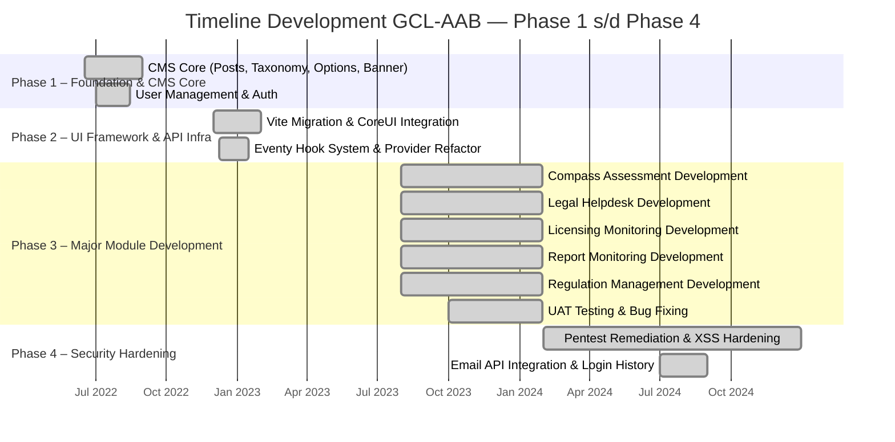

# Analisis Reverse Engineering: GCL-AAB — Phase 1 s/d Phase 4

> Dianalisis pada: 14 Mei 2026
> Repository: D:\laragon\www\gcl-aab
> Analis: Claude Code (Reverse Engineering Mode)
> Cakupan: Phase 1 (Foundation) — Phase 4 (Security Hardening)

---

## 1. Deskripsi Proyek

GCL-AAB adalah sebuah sistem manajemen kepatuhan (compliance management) dan hukum berbasis web yang dibangun menggunakan framework Laravel 9.x. Pada Phase 1 hingga Phase 4, sistem ini dibangun dari nol mencakup fondasi CMS, infrastruktur UI, serta lima modul bisnis utama yang menjadi inti dari platform ini.

Sistem ini dirancang untuk membantu organisasi dalam mengelola seluruh aspek kepatuhan regulasi, penilaian risiko, pengelolaan dokumen hukum, pemantauan perizinan, serta pelaporan regulasi rutin. Dari struktur database yang terdiri dari lebih dari 221 migrasi, dapat disimpulkan bahwa sistem ini menangani domain bisnis yang sangat kompleks dengan banyak entitas yang saling berhubungan.

Aplikasi ini menggunakan arsitektur modular monolitik, di mana setiap modul bisnis utama diwakili oleh service provider tersendiri yang mendaftarkan repository, capability (otorisasi), dan menu sampingnya masing-masing. Terdapat lima modul utama yang dibangun pada fase ini: Compass Assessment (penilaian kepatuhan), Legal Helpdesk (pengelolaan dokumen hukum), Licensing Monitoring (pemantauan perizinan), Report Monitoring (pelaporan regulasi), dan Regulation Management (manajemen peraturan eksternal dan internal). Selain itu, sistem ini juga memiliki backend CMS dengan fitur manajemen pengguna, peran (role), master data, dan konfigurasi sistem.

Pengguna sistem ini mencakup berbagai peran organisasi, mulai dari staf departemen (asesi), asesor, koordinator, checker legal, PIC (Person in Charge) per modul, hingga administrator sistem. Sistem mendukung autentikasi melalui Active Directory AAB dan memiliki mekanisme reminder otomatis melalui scheduled jobs untuk tugas-tugas penting seperti laporan rutin, dokumen yang akan expired, dan penilaian yang overdue.

---

## 2. Permasalahan (Problem Statement)

1. **Fragmentasi Pengelolaan Dokumen Hukum** — Organisasi menghadapi kesulitan dalam mengelola berbagai jenis dokumen hukum (NKB, OHK, PKS, SK, SP, SPK) secara terpusat, termasuk tracking persetujuan, lampiran, pihak terkait, dan masa berlaku dokumen.

2. **Kurangnya Transparansi Kepatuhan Regulasi** — Sulitnya melacak status kepatuhan departemen terhadap peraturan eksternal dan internal, termasuk implikasi pasal-pasal yang harus diimplementasikan di tingkat operasional.

3. **Kompleksitas Proses Penilaian dan Review** — Proses penilaian kepatuhan (Compass Assessment) memerlukan alur kerja multi-tahap yang melibatkan asesi, asesor, dan koordinator dengan mekanisme approval, revisi, dan monitoring tindak lanjut (improvement) yang rumit untuk dikelola secara manual.

4. **Risiko Kedaluwarsa Dokumen Perizinan** — Tidak adanya sistem peringatan dini (early warning) untuk dokumen perizinan yang akan expired dapat mengakibatkan operasional terganggu atau sanksi hukum.

5. **Keterlambatan Pelaporan Regulasi Rutin** — Laporan regulasi yang bersifat periodik (bulanan, triwulanan) seringkali terlambat karena tidak ada sistem reminder terintegrasi dengan konfigurasi PIC per departemen.

6. **Kebutuhan Audit Trail dan Keamanan** — Diperlukan pencatatan riwayat aktivitas (audit trail) dan validasi input yang ketat (XSS prevention) untuk memenuhi standar keamanan dan audit, terutama setelah temuan pentest.

---

## 3. Solusi yang Dibangun

| Permasalahan | Solusi / Fitur yang Dibangun |
|---|---|
| Fragmentasi Dokumen Hukum | Modul **Legal Helpdesk** dengan kontroler untuk NKB, OHK, PKS, SK, SP, SPK, fitur upload lampiran, pihak terkait, paraf checker, dan approval admin |
| Transparansi Kepatuhan Regulasi | Modul **Regulation Management** dengan katalog peraturan eksternal/internal, penjabaran pasal ayat, implikasi peraturan, dan modul **Compass Assessment** untuk tracking pemenuhan |
| Kompleksitas Penilaian | Modul **Compass Assessment** dengan workflow: asesi mengisi → asesor review → koordinator approve, dilengkapi monitoring improvement, corrective action, dan threshold assessment |
| Risiko Kedaluwarsa Perizinan | Modul **Licensing Monitoring** dengan tracking dokumen perijinan, reminder expired via scheduled jobs, dan dashboard visualisasi |
| Keterlambatan Pelaporan | Modul **Report Monitoring** dengan konfigurasi PIC per departemen, reminder laporan rutin, dan tracking status pemenuhan per periode |
| Audit Trail & Keamanan | Fitur **AuditTrail** pada model, middleware XSS validation, captcha, login history, user stamps (created_by/updated_by), dan remediasi hasil pentest |

---

## 4. Tujuan Proyek

1. **Sentralisasi Manajemen Kepatuhan** — Menyatukan seluruh proses kepatuhan regulasi, dokumen hukum, dan perizinan dalam satu platform terintegrasi.

2. **Otomatisasi Workflow Multi-Level** — Mengotomatisasi alur kerja penilaian, review, dan approval yang melibatkan banyak peran dengan notifikasi real-time.

3. **Peningkatan Visibilitas dan Akuntabilitas** — Memberikan dashboard dan laporan yang transparan untuk setiap tingkatan organisasi, dari direktorat hingga departemen/cabang.

4. **Pencegahan Risiko Regulasi** — Mengurangi risiko keterlambatan pelaporan dan kedaluwarsa dokumen melalui sistem reminder otomatis dan monitoring berkala.

5. **Keamanan dan Keterlacakan Data** — Memastikan setiap perubahan data tercatat (audit trail) dan sistem terlindungi dari serangan umum seperti XSS dan script injection.

---

## 5. Tech Stack

### Frontend
| Teknologi | Versi | Peran |
|---|---|---|
| Vite | 3.0.0 | Build tool utama (webpack.mix.js legacy/tidak aktif) |
| laravel-vite-plugin | 0.7.1 | Integrasi Vite dengan Laravel |
| Bootstrap | 4.6.2 | Framework CSS utama |
| jQuery | 3.7.0 | Manipulasi DOM dan AJAX |
| Sass | 1.94.2 | Preprocessor CSS untuk multiple skin themes |
| Livewire | 2.10 | Komponen dinamis server-side tanpa menulis JavaScript |
| Simplebar | 5.3.9 | Custom scrollbar |
| vite-plugin-static-copy | 0.13.0 | Copy asset statis ke build output |

### Backend
| Teknologi | Versi | Peran |
|---|---|---|
| PHP | ^8.0.2 | Bahasa pemrograman utama |
| Laravel | 9.19.0 | Framework aplikasi web |
| Laravel UI | 3.4 | Scaffolding autentikasi |
| Laravel Sanctum | 2.14.1 | API token authentication |
| Livewire | 2.10 | Komponen reaktif server-rendered |
| Maatwebsite Excel | 3.1 | Import/export Excel |
| PhpWord | 1.1 | Generasi dokumen Word |
| Intervention Image | 2.7 | Manipulasi gambar |
| Spatie Laravel Sluggable | 3.4 | Generate slug otomatis |
| Spatie Image Optimizer | 1.7 | Optimasi gambar otomatis |
| Mews Captcha | 3.3 | Validasi captcha |
| Number to Words | 2.7 | Konversi angka ke kata |
| Laravel Debugbar | 3.6 | Debugging development |

### Database & Storage
| Teknologi | Versi | Peran |
|---|---|---|
| MySQL | — | Database utama (default connection) |
| Redis | — | Cache/session (opsional, tersedia konfigurasi) |
| Local File Storage | — | Penyimpanan file upload dengan path kustom via env |

### DevOps & Tooling
| Teknologi | Versi | Peran |
|---|---|---|
| PHPUnit | 9.5.10 | Unit dan feature testing |
| StyleCI | — | Code style linting (Laravel preset) |
| patch-package | 8.0.0 | Patch package node_modules |
| EditorConfig | — | Standarisasi format file |
| Git | — | Version control |

---

## 6. Timeline Development Phase 1–4 (Gantt Chart)

> Direkonstruksi dari git commit history.
> Rentang waktu: **17 Jun 2022** s/d **31 Des 2024**

### Ringkasan Fase Development

| Fase | Nama Fase | Periode | Fitur Utama | Jumlah Commit |
|---|---|---|---|---|
| Phase 1 | Foundation & CMS Core | 17 Jun 2022 – 31 Agu 2022 | Posts, Taxonomy, Banner, Options, User Management | 109 |
| Phase 2 | UI Framework & API Infra | 01 Des 2022 – 31 Jan 2023 | Vite, CoreUI, Eventy, Cron/Queue, Log Viewer | 54 |
| Phase 3 | Major Module Development | 01 Agu 2023 – 31 Jan 2024 | Compass Assessment, Legal Helpdesk, Licensing, Report, Regulation | 571 |
| Phase 4 | Security Hardening | 01 Feb 2024 – 31 Des 2024 | Pentest Remediation, XSS Prevention, Email API, Login History | 44 |

---

## 7. Catatan Analis

1. **Arsitektur Modular yang Konsisten** — Pola arsitektur yang paling menonjol adalah penggunaan service provider per modul yang mendaftarkan repository pattern (interface + Eloquent implementation) dan capability authorization secara terpusat. Ini memudahkan pemeliharaan dan penambahan modul baru, namun ketergantungan pada custom helper functions (`register_authorization_context`, `add_context_capability`) membuat sistem ini sulit dipahami oleh developer Laravel standar tanpa dokumentasi internal.

2. **Technical Debt yang Teridentifikasi** — Terdapat beberapa tanda technical debt: (a) `webpack.mix.js` yang tidak lagi digunakan namun masih ada di root, (b) duplikasi controller untuk auth (Backend dan Frontend memiliki file login/register terpisah), (c) penggunaan string literal untuk nama route dan capability yang tersebar di seluruh codebase, dan (d) tidak adanya test suite yang substantif (hanya 2 file test contoh). Selain itu, migrasi yang sangat banyak (221+) menunjukkan evolusi skema yang intensif tanpa konsolidasi.

3. **Area yang Kurang Terdokumentasi** — Tidak ditemukan dokumen arsitektur, changelog, atau wiki proyek pada fase ini. Pengetahuan domain sangat bergantung pada pemahaman commit messages dan kode sumber. Sistem Eventy (hook system) yang menjadi tulang punggung ekstensibilitas CMS hanya didokumentasikan dalam `app/Api/Eventy/README.md` yang merupakan dokumentasi library pihak ketiga, bukan dokumentasi penggunaan internal proyek.

---

*Dokumen ini dihasilkan secara otomatis melalui reverse engineering repository. Validasi manual oleh System Analyst direkomendasikan sebelum digunakan sebagai dokumen resmi.*
