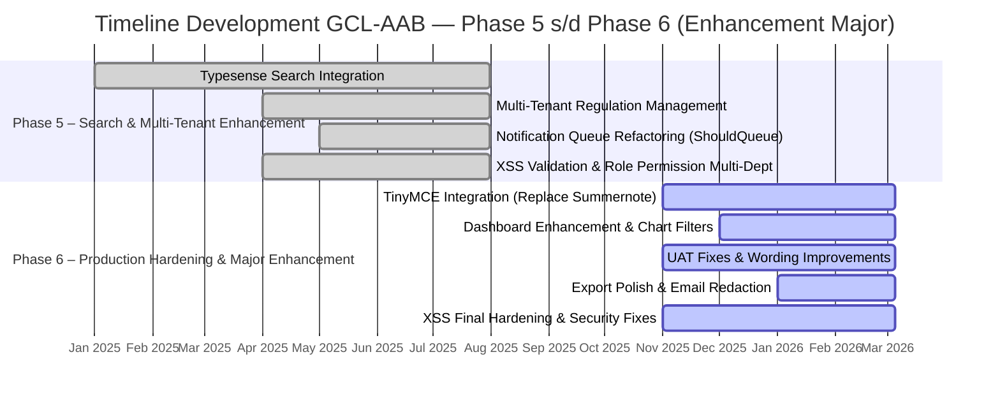

# Analisis Reverse Engineering: GCL-AAB — Phase 5 s/d Phase 6 (Enhancement Major)

> Dianalisis pada: 14 Mei 2026
> Repository: D:\laragon\www\gcl-aab
> Analis: Claude Code (Reverse Engineering Mode)
> Cakupan: Phase 5 (Search & Multi-Tenant Enhancement) — Phase 6 (Production Hardening & Major Enhancement)

---

## 1. Deskripsi Proyek

Fase Phase 5 dan Phase 6 merupakan periode **enhancement major** dari sistem GCL-AAB yang sebelumnya telah berhasil dibangun dengan lima modul inti pada Phase 1–4. Pada fase ini, pengembangan tidak lagi berfokus pada pembuatan modul bisnis baru dari nol, melainkan pada **peningkatan kapabilitas sistem secara signifikan** melalui integrasi mesin pencarian canggih, dukungan multi-tenant, perbaikan UX/UI berskala besar, serta hardening produksi menjelang go-live stabil.

Phase 5 (Januari–Juli 2025) menghadirkan **Typesense sebagai search engine** untuk pencarian dokumen dan peraturan secara real-time, serta pengembangan **Regulation Management multi-tenant** yang memungkinkan entitas hukum atau organisasi yang berbeda untuk mengelola peraturan dalam satu instance aplikasi. Fase ini juga mencakup perbaikan fundamental pada sistem notifikasi dengan mengubahnya menjadi queue-based (`ShouldQueue`) untuk menangani volume notifikasi yang besar.

Phase 6 (November 2025–Maret 2026) adalah periode **production hardening** yang intensif. Sistem mengalami penggantian editor rich text dari Summernote ke **TinyMCE** di seluruh modul, penambahan fitur **visibility password**, perbaikan masif berdasarkan catatan UAT (User Acceptance Testing), enhancement dashboard dengan chart dan filter, polishing export dokumen, serta hardening XSS final. Fase ini mencerminkan persiapan sistem untuk operasional produksi yang stabil dengan fokus pada kualitas, keamanan, dan pengalaman pengguna.

Secara keseluruhan, Phase 5–6 menunjukkan evolusi sistem dari MVP (Minimum Viable Product) yang fungsional menjadi **platform enterprise yang matang**, dengan pencarian yang powerful, skalabilitas multi-tenant, dan standar keamanan yang lebih tinggi.

---

## 2. Permasalahan (Problem Statement)

1. **Pencarian Dokumen dan Peraturan yang Tidak Efisien** — Dengan bertambahnya volume data peraturan eksternal, internal, dan dokumen hukum, pencarian berbasis query SQL sederhana menjadi lambat dan tidak mampu memberikan hasil yang relevan dengan typo-tolerance atau highlighting.

2. **Kebutuhan Multi-Tenant untuk Regulation Management** — Organisasi memerlukan kemampuan untuk memisahkan domain peraturan berdasarkan entitas atau tenant yang berbeda tanpa harus men-deploy instance aplikasi terpisah.

3. **Performance Notifikasi yang Menurun** — Sistem notifikasi yang dijalankan secara synchronous menyebabkan bottleneck ketika jumlah pengguna dan event notifikasi meningkat, terutama untuk reminder bulk.

4. **Keterbatasan Rich Text Editor Summernote** — Editor yang digunakan pada fase awal memiliki keterbatasan dalam formatting, styling, dan rentan terhadap XSS injection. Kebutuhan akan editor yang lebih robust dan customizable menjadi sangat mendesak.

5. **Gap antara Hasil Development dan Ekspektasi UAT** — Setelah pengujian oleh pengguna akhir, ditemukan banyak catatan perbaikan yang harus diimplementasikan sebelum sistem dapat digunakan secara produksi, meliputi UX, wording, validasi, dan alur bisnis.

6. **Standar Keamanan yang Perlu Ditingkatkan** — Temuan dari fase security hardening sebelumnya (Phase 4) menunjukkan perlunya hardening berkelanjutan, terutama pada validasi input, sanitasi HTML, dan proteksi terhadap serangan XSS di seluruh form.

---

## 3. Solusi yang Dibangun

| Permasalahan | Solusi / Fitur yang Dibangun |
|---|---|
| Pencarian Tidak Efisien | Integrasi **Typesense** sebagai search engine dengan Laravel Scout. Fitur pencarian mencakup typo-tolerance (`num_typos`), highlight result, filter facet, dan indeks dokumen peraturan internal/eksternal secara real-time |
| Kebutuhan Multi-Tenant | Pengembangan **Regulation Management Multi-Tenant** dengan namespace tenant pada route, controller, dan model. Memungkinkan isolasi data peraturan per entitas dalam satu database |
| Performance Notifikasi | Refactoring notifikasi ke **queue-based** (`ShouldQueue`) untuk reminder compass assessment, licensing monitoring, dan laporan regulasi. Mengurangi blocking pada request utama |
| Keterbatasan Summernote | Migrasi ke **TinyMCE** dengan konfigurasi toolbar kustom, plugin tambahan, dan API key terpusat yang dikelola melalui menu konfigurasi backend |
| Catatan UAT | Perbaikan berskala besar pada wording, flow approval, export formatting (font Calibri, page break), dashboard filter, sticky table, hover state, dan validasi form berdasarkan feedback UAT |
| Hardening Keamanan | Implementasi **XSS validation** menyeluruh pada semua input teks, sanitasi HTML sebelum indeks Typesense, prevent script tags, validasi file upload, dan audit trail per periode laporan |

---

## 4. Tujuan Proyek Enhancement

1. **Peningkatan Discoverability Data** — Memastikan pengguna dapat menemukan dokumen dan peraturan dengan cepat melalui pencarian yang powerful, toleran kesalahan ketik, dan hasil yang relevan.

2. **Skalabilitas Organisasi** — Mendukung pertumbuhan organisasi dengan kemampuan multi-tenant yang memungkinkan pengelolaan peraturan untuk entitas yang berbeda dalam satu platform.

3. **Stabilitas dan Performance Produksi** — Menjamin sistem dapat menangani beban notifikasi dan traffic produksi tanpa degradasi performance melalui queue processing dan optimasi query.

4. **Peningkatan User Experience** — Menyempurnakan antarmuka pengguna berdasarkan feedback UAT real-world, termasuk editor yang lebih baik, dashboard yang informatif, dan export yang profesional.

5. **Kepatuhan Keamanan Enterprise** — Memenuhi standar keamanan yang lebih tinggi dengan hardening XSS, validasi input komprehensif, dan sanitasi data sebelum indexing dan rendering.

---

## 5. Tech Stack Enhancement

### Frontend Enhancement
| Teknologi | Versi | Peran |
|---|---|---|
| TinyMCE | — | Rich text editor pengganti Summernote di seluruh modul |
| Vite | 3.0.0 | Build tool (tetap, dengan penambahan entrypoint plugin TinyMCE) |
| Sass | 1.94.2 | Penambahan custom style untuk TinyMCE view dan sticky table |
| patch-package | 8.0.0 | Patch library node_modules jika diperlukan |

### Backend Enhancement
| Teknologi | Versi | Peran |
|---|---|---|
| Typesense Scout Driver | 5.2 | Full-text search engine untuk pencarian dokumen/peraturan |
| Laravel Scout | — | Abstraksi search indexing untuk Typesense |
| Laravel Queue | — | Queue-based notification (ShouldQueue) |
| TinyMCE API | — | Konfigurasi API key TinyMCE terpusat via backend option |

### Database & Storage
| Teknologi | Versi | Peran |
|---|---|---|
| MySQL | — | Tetap, dengan penambahan tabel/index untuk multi-tenant |
| Typesense Server | — | Search cluster/engine eksternal |
| Local File Storage | — | Penyimpanan file dengan repopulate temporary file pada edit |

### DevOps & Tooling
| Teknologi | Versi | Peran |
|---|---|---|
| PHPUnit | 9.5.10 | Tetap, test suite belum signifikan ditambahkan |
| Git | — | Version control enhancement period |

---

## 6. Timeline Development Phase 5–6 (Gantt Chart)

> Direkonstruksi dari git commit history.
> Rentang waktu enhancement: **01 Jan 2025** s/d **05 Mar 2026**

### Ringkasan Fase Enhancement

| Fase | Nama Fase | Periode | Fitur Utama | Jumlah Commit |
|---|---|---|---|---|
| Phase 5 | Search & Multi-Tenant Enhancement | 01 Jan 2025 – 31 Jul 2025 | Typesense Search, Multi-Tenant Regulation, Notification Queue, XSS/Role Multi-Dept | 47 |
| Phase 6 | Production Hardening & Major Enhancement | 01 Nov 2025 – 05 Mar 2026 | TinyMCE, Dashboard Enhancement, UAT Fixes, Export Polish, XSS Final | 179 |

---

## 7. Catatan Analis

1. **Shift dari Feature Development ke Enhancement & Polish** — Perubahan signifikan pada Phase 5–6 adalah transisi dari pembangunan fitur besar ke peningkatan kualitas dan kemampuan sistem. Commit messages menunjukkan pola repetitif `fix: catatan uat ...`, `feat: enhance ...`, dan `fix: validasi xss ...`, yang mengindikasikan fase ini adalah periode maturasi produk menjelang stabilisasi.

2. **Integrasi Typesense sebagai Game Changer** — Penambahan Typesense pada Phase 5 merupakan enhancement teknis yang paling berdampak. Hal ini mengubah paradigma pencarian dari query database tradisional ke search engine yang memiliki typo-tolerance, highlighting, dan performansi real-time. Namun, ditemukan validasi khusus untuk menangani kondisi server Typesense down, yang menunjukkan awareness tim terhadap single point of failure.

3. **Technical Debt yang Berlanjut** — Meskipun fase ini intensif pada polishing, beberapa technical debt dari fase awal tidak teratasi: test suite tetap minim, duplikasi controller auth masih ada, dan penggunaan string literal untuk route/capability semakin meluas seiring penambahan fitur baru. Rekomendasi untuk fase selanjutnya adalah konsolidasi migrasi (squash), refactoring string literal ke konstanta class, dan penambahan integration test untuk alur notifikasi dan search indexing.

---

*Dokumen ini dihasilkan secara otomatis melalui reverse engineering repository. Validasi manual oleh System Analyst direkomendasikan sebelum digunakan sebagai dokumen resmi.*
