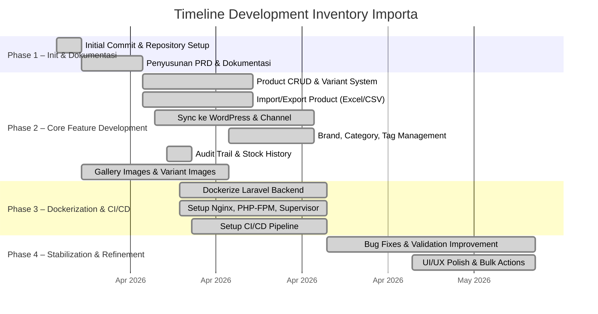

# Analisis Reverse Engineering: Inventory Importa

> Dianalisis pada: 2026-05-14
> Repository: D:\laragon\www\inventory-importa
> Analis: Claude Code (Reverse Engineering Mode)

---

## 1. Deskripsi Proyek

**Inventory Importa** adalah sebuah aplikasi backend berbasis web yang dibangun menggunakan framework Laravel untuk mengelola data produk secara terpusat dan terstruktur. Sistem ini bertindak sebagai *single source of truth* bagi data katalog produk perusahaan Importa, yang kemudian disinkronkan ke website utama berbasis WordPress (WooCommerce). Dengan arsitektur ini, proses pembaruan katalog produk tidak lagi bergantung pada edit manual berulang di sisi website company profile.

Aplikasi ini dikembangkan di atas fondasi CMS bernama **Tonjoo Admin Panel** — sebuah Laravel CMS dengan arsitektur modular yang menggunakan pola *Eventy* (mirip plugin WordPress) untuk ekstensibilitas, serta sistem *group-based permission* untuk kontrol akses. Sistem ini memiliki dua tipe pengguna utama: **Super Admin** yang memiliki akses penuh termasuk manajemen pengguna dan konfigurasi API, serta **Admin Sistem** yang fokus pada operasional harian pengelolaan katalog produk.

Ruang lingkup utama mencakup pengelolaan master data produk, brand, kategori, dan tag; mekanisme *bulk import* dan *export* melalui file Excel/CSV; pengaturan peran dan izin pengguna (*RBAC*); *audit trail* untuk melacak perubahan data; serta penyediaan API *read-only* untuk kebutuhan sinkronisasi ke website utama. Proyek ini juga dilengkapi dengan infrastruktur Docker lengkap yang mencakup MariaDB, Redis, Nginx, PHP-FPM, dan Supervisor untuk mendukung pengembangan dan *deployment* yang konsisten.

---

## 2. Permasalahan (Problem Statement)

1. **Manajemen Katalog yang Tersebar dan Tidak Terstruktur** — Data produk Importa sebelumnya dikelola secara manual dan tersebar, menyebabkan inkonsistensi informasi produk, harga, stok, dan kategori antar channel publikasi.

2. **Proses Update Katalog yang Lambat dan Berisiko Error** — Setiap perubahan data produk harus diedit langsung di website WordPress, yang tidak efisien untuk volume besar dan rentan terhadap kesalahan input manual, terutama saat menangani produk dengan banyak varian.

3. **Tidak Ada Kendali Akses Berbasis Peran** — Tidak adanya sistem *role-based access control* yang jelas membuat sulit untuk membatasi hak akses antara level manajemen (Super Admin) dan level operasional (Admin Sistem).

4. **Kurangnya Traceability dan Audit Trail** — Perubahan data produk, terutama stok, tidak memiliki riwayat yang dapat ditelusuri, sehingga sulit mengidentifikasi siapa yang melakukan perubahan dan kapan perubahan terjadi.

5. **Tidak Ada Mekanisme Bulk Operation** — Proses pemasukan atau pembaruan data produk dalam jumlah besar harus dilakukan satu per satu, yang sangat tidak efisien untuk katalog dengan ratusan atau ribuan SKU.

6. **Sinkronisasi Data ke Website Utama yang Tidak Terintegrasi** — Tidak ada mekanisme otomatis untuk menyelaraskan data produk dari sistem internal ke website publik berbasis WordPress, menyebabkan ketidakselarasan informasi di kedua platform.

---

## 3. Solusi yang Dibangun

| Permasalahan | Solusi / Fitur yang Dibangun |
|---|---|
| Manajemen katalog tersebar | Modul **CRUD Product** lengkap dengan section Product Description, Product Data, Short Description, Image, Gallery, Categories, Tags, dan Brands. Mendukung produk tipe *simple* maupun *variable* dengan variant SKU. |
| Update manual di WordPress | Sistem **Sync ke WordPress** melalui Public API dengan mekanisme acknowledgement per SKU (`is_synced`, `synced_at`), serta cron job untuk sinkronisasi terjadwal. |
| Tidak ada RBAC | Sistem **Group-Based Permission** dengan konteks capability (`master`, `post`, `page`, `media`, `taxonomy`, `option`) dan caching permission untuk performa. Mendukung Group Template untuk preset permission. |
| Kurangnya audit trail | Tabel **Audit Trail** dan **Stock History** yang mencatat setiap perubahan stok termasuk `qty_before`, `qty_after`, `delta`, `actor_id`, dan `created_at`. |
| Tidak ada bulk operation | Fitur **Import & Export Product** berbasis template Excel/CSV dengan preview validasi, dukungan upsert (insert/update), serta filter berdasarkan taxonomy. |
| Sinkronisasi tidak terintegrasi | **Public Sync API** (`/api/v1/public/products`) yang dilindungi API key dan domain allowlist, serta endpoint detail per SKU untuk konsumsi website WordPress. |

---

## 4. Tujuan Proyek

1. **Membangun Single Source of Truth untuk Data Produk** — Seluruh perubahan data katalog dilakukan melalui admin panel Inventory sebelum disinkronkan ke channel publikasi, memastikan konsistensi informasi produk di semua platform.

2. **Meningkatkan Efisiensi Operasional Katalog** — Menyediakan kemampuan *bulk import* dan *export* produk melalui template standar sehingga tim katalog dapat memperbarui ratusan produk dalam satu kali unggahan.

3. **Menerapkan Governance dan Kontrol Akses** — Mengimplementasikan sistem RBAC berbasis grup dengan pemisahan hak akses antara Super Admin (governance) dan Admin Sistem (operasional) untuk menjaga keamanan data.

4. **Menyediakan Traceability Penuh atas Perubahan Data** — Mencatat riwayat perubahan stok dan aktivitas penting dalam audit trail agar setiap modifikasi data dapat ditelusuri hingga ke pelaku dan waktu kejadian.

5. **Mendukung Skalabilitas Produk dengan Varian** — Membangun arsitektur data yang mendukung produk dengan banyak varian (variable product), atribut dinamis, dan SKU unik per kombinasi varian, siap untuk pertumbuhan katalog masa depan.

---

## 5. Tech Stack

### Frontend
| Teknologi | Versi | Peran |
|---|---|---|
| Vue.js | ^3.4.21 | Framework frontend untuk komponen interaktif |
| @vue/compat | ^3.5.30 | Mode kompatibilitas Vue 2 ke Vue 3 |
| Bootstrap | ^4.6.2 | CSS framework untuk styling admin panel |
| jQuery | ^3.7.0 | Manipulasi DOM legacy dan plugin jQuery |
| Vite | ^7.0.6 | Build tool dan dev server |
| @vitejs/plugin-vue | ^6.0.5 | Plugin Vite untuk kompilasi file .vue |
| Sass | ^1.56.2 | Preprocessor CSS |
| GLightbox | ^3.3.0 | Lightbox untuk preview gambar produk |

### Backend
| Teknologi | Versi | Peran |
|---|---|---|
| PHP | ^8.3 | Bahasa pemrograman server-side |
| Laravel | ^12.0 | Framework PHP utama |
| Laravel Sanctum | ^4.0 | Autentikasi API token |
| Laravel UI | ^4.0 | Scaffolding autentikasi |
| Livewire | ^3.0 | Komponen dinamis full-stack |
| Maatwebsite Excel | ^3.1 | Import/export file Excel/CSV |
| Intervention Image Laravel | ^1.5 | Manipulasi dan resize gambar |
| Spatie Laravel Sluggable | ^3.4 | Auto-generate slug untuk SEO |
| Spatie Laravel Image Optimizer | ^1.7 | Optimasi gambar otomatis |
| GuzzleHTTP | ^7.2 | HTTP client untuk sinkronisasi ke WordPress |
| Doctrine DBAL | ^3.3 | Database abstraction layer |

### Database & Storage
| Teknologi | Versi | Peran |
|---|---|---|
| MariaDB | 11.3.2 | Database relasional utama |
| Redis | latest | Caching, session store, dan queue backend |
| MySQL (local dev) | — | Database alternatif untuk development tanpa Docker |

### DevOps & Tooling
| Teknologi | Versi | Peran |
|---|---|---|
| Docker | 20.10+ | Containerization |
| Docker Compose | 2.0+ | Orkestrasi multi-container |
| Ubuntu | 24.04 | Base image container |
| Nginx (custom) | — | Web server reverse proxy |
| PHP-FPM | 8.3 | FastCGI process manager |
| Supervisor | — | Process management (Nginx, PHP-FPM, Queue Worker, Scheduler) |
| Node.js | 20.x | Runtime untuk build asset frontend |
| Composer | 2.0+ | Dependency manager PHP |
| phpMyAdmin | — | GUI manajemen database |
| Redis Commander | — | GUI manajemen Redis |
| PHPUnit | ^11.0.1 | Unit testing |
| Laravel Debugbar | ^3.8 | Debugging development |

---

## 6. Timeline Development (Gantt Chart)

> Direkonstruksi dari git commit history.
> Rentang waktu proyek: **2026-03-30** s/d **2026-05-08**

### Ringkasan Fase Development

| Fase | Nama Fase | Periode | Fitur Utama | Jumlah Commit |
|---|---|---|---|---|
| Phase 1 | Init & Dokumentasi | 30 Mar 2026 – 06 Apr 2026 | Setup repo, PRD v1.0, ERD design, definisi acceptance criteria | ~10 |
| Phase 2 | Core Feature Development | 06 Apr 2026 – 21 Apr 2026 | Product CRUD, variant system, import/export, WordPress sync, taxonomy management, audit trail | ~70 |
| Phase 3 | Dockerization & CI/CD | 09 Apr 2026 – 21 Apr 2026 | Docker multi-container (MariaDB, Redis, Nginx, PHP-FPM), Supervisor, CI/CD pipeline | ~20 |
| Phase 4 | Stabilization & Refinement | 21 Apr 2026 – 08 Mei 2026 | Bug fixing, validation UX, bulk delete, delimiter input, filter improvements, sticky layout | ~56 |

---

## 7. Catatan Analis

1. **Arsitektur Hybrid CMS + Inventory** — Proyek ini menarik karena dibangun di atas fondasi CMS generik (Tonjoo Admin Panel) yang kemudian diperluas dengan modul inventory spesifik. Pola *Eventy* (hook system ala WordPress) yang digunakan memberikan fleksibilitas tinggi, namun juga menambah kompleksitas karena alur eksekusi bisa tersebar di banyak listener. Ini merupakan pola arsitektur yang umum di agency/agensi web yang memiliki produk CMS internal yang kemudian dikustomisasi per klien.

2. **Dockerisasi yang Matang namun Manual** — Setup Docker yang dibangun cukup komprehensif dengan multi-stage Dockerfile (dev vs production image), custom Nginx, PHP-FPM tuning, Supervisor untuk queue worker dan scheduler, serta pemisahan persistent storage. Namun, proses setup awal masih memerlukan beberapa langkah manual seperti copy storage structure dan install Vue plugin secara terpisah, yang mengindikasikan ada ruang untuk penyempurnaan automation pada onboarding developer.

3. **Potensi Technical Debt pada Integrasi WordPress** — Dari analisis commit history dan migration, terlihat adanya perubahan signifikan pada strategi sinkronisasi: awalnya menggunakan `wordpress_id` di tabel produk, kemudian dihapus dan diganti dengan sinkronisasi berbasis SKU. Perubahan strategi di tengah jalan serta adanya penambahan/pengurangan kolom sync berkali-kali (`sync_columns`, `sync_lifecycle_columns`, lalu `drop_legacy_sync_columns`) mengindikasikan bahwa requirement integrasi dengan WordPress/WooCommerce tidak sepenuhnya stabil sejak awal dan memerlukan iterasi berulang.

---

*Dokumen ini dihasilkan secara otomatis melalui reverse engineering repository. Validasi manual oleh System Analyst direkomendasikan sebelum digunakan sebagai dokumen resmi.*
