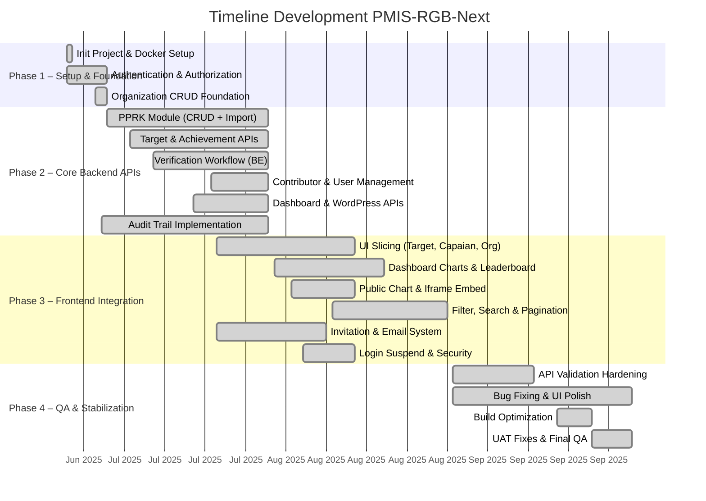

# Analisis Reverse Engineering: PMIS-RGB-Next

> Dianalisis pada: 14 Mei 2026
> Repository: pmis-rgb-next
> Analis: Claude Code (Reverse Engineering Mode)

---

## 1. Deskripsi Proyek

PMIS-RGB-Next adalah sistem informasi dan monitoring program berbasis web yang dibangun untuk mendukung pengelolaan **Program Rendah Karbon (PPRK)** dan koalisi organisasi di Indonesia. Sistem ini menyediakan platform terpusat bagi berbagai pemangku kepentingan — mulai dari organisasi pelaksana, kontributor, verifikator, hingga admin — untuk mengelola data program, menetapkan target, melaporkan capaian, serta melakukan verifikasi secara terstruktur.

Secara arsitektural, proyek ini merupakan **monorepo** yang terdiri dari empat layanan utama yang diorkestrasi melalui Docker Compose: (1) Backend Admin berbasis Laravel 11 dengan Inertia.js dan React 18 untuk manajemen administrasi; (2) Dashboard Aplikasi berbasis Next.js 15 dengan React 19 sebagai antarmuka utama pengguna; (3) Website Publik berbasis Next.js 15 untuk transparansi publik; dan (4) Infrastruktur pendukung berupa MariaDB, Redis, Nginx, Traefik, serta panel admin seperti phpMyAdmin.

Domain bisnis utama yang dilayani meliputi: pencatatan program rendah karbon per provinsi/kabupaten kota, pengelolaan organisasi dan kontributor koalisi, penjadwalan target dengan milestone, pelaporan capaian berkala, alur verifikasi dua tingkat (target dan capaian), audit trail perubahan data, serta dashboard analitik dengan leaderboard dan visualisasi chart untuk publik.

---

## 2. Permasalahan (Problem Statement)

1. **Tidak Adanya Sistem Terpusat untuk Monitoring Program Rendah Karbon** — Sebelumnya, data program rendah karbon tersebar di berbagai kanal (spreadsheet, dokumen, sistem terpisah) sehingga sulit dilakukan pelacakan konsolidasi, pelaporan Berkala, dan evaluasi dampak emisi secara nasional.

2. **Proses Verifikasi Target dan Capaian yang Tidak Terstruktur** — Verifikasi terhadap target yang ditetapkan organisasi serta capaian yang dilaporkan dilakukan secara manual dan tidak memiliki alur baku (workflow), menyebabkan inkonsistensi data dan keterlambatan persetujuan.

3. **Kesulitan Manajemen Multi-Organisasi dan Multi-Peran** — Dalam satu koalisi, terdapat banyak organisasi dengan berbagai peran (lead, kontributor, verifikator, admin). Tanpa sistem manajemen pengguna berbasis peran (RBAC), koordinasi antarorganisasi menjadi tidak efisien dan rawan kesalahan akses.

4. **Kurangnya Transparansi dan Akuntabilitas Publik** — Publik dan pemangku kepentingan tidak memiliki akses mudah ke data program rendah karbon, leaderboard organisasi, dan progress capaian, sehingga akuntabilitas pelaksana program rendah.

5. **Risiko Integritas Data tanpa Audit Trail** — Perubahan data target maupun capaian oleh banyak pihak tidak tercatat dengan baik, sehingga sulit dilakukan penelusuran (traceability) jika ditemukan kesalahan atau manipulasi data.

6. **Kompleksitas Pengelolaan Data Spasial dan Sektor Mitigasi** — Program rendah karbon mencakup banyak variabel: lokasi geografis (provinsi, kabupaten/kota), sektor mitigasi, program pemerintah terkait, dan indikator penurunan emisi. Tanpa sistem terintegrasi, pengelolaan referensi data ini menjadi fragmentasi.

---

## 3. Solusi yang Dibangun

| Permasalahan | Solusi / Fitur yang Dibangun |
|---|---|
| Tidak adanya sistem terpusat | Monorepo dengan Backend Laravel (API + Admin), Next.js Dashboard, dan Next.js Website Publik yang terintegrasi melalui REST API dan Sanctum Authentication |
| Verifikasi tidak terstruktur | Modul **Verifikasi Target** dan **Verifikasi Capaian** dengan status workflow (draft, menunggu verifikasi, disetujui, perlu revisi), dilengkapi komentar verifikator dan audit trail |
| Manajemen multi-organisasi | Modul **Manajemen Organisasi**, **Manajemen Kontributor** dengan fitur invitation via email, serta **Manajemen Pengguna** berbasis peran (role) dan permission granuler |
| Kurangnya transparansi publik | **Website Publik** (Next.js), **Dashboard Program Koalisi** dengan chart Recharts, **Leaderboard PPRK**, dan endpoint iframe chart yang dapat di-embed publik |
| Risiko integritas data | Implementasi **Audit Trail** menggunakan `owen-it/laravel-auditing` pada model Target, Achievement, dan Organization; tersedia menu Auditable Log Viewer di backend admin |
| Kompleksitas data spasial | Master data **Provinsi**, **Kabupaten/Kota**, **Sektor Mitigasi**, **Program Pemerintah**, dan **Bidang Kerja** sebagai referensi terpusat; modul PPRK dengan mapping wilayah dan sektor |

---

## 4. Tujuan Proyek

1. **Membangun Single Source of Truth untuk Data Program Rendah Karbon** — Menyatukan seluruh data program, target, capaian, dan organisasi dalam satu platform terintegrasi yang dapat diakses oleh semua pemangku kepentingan sesuai peran.

2. **Menstandarisasi Alur Verifikasi Target dan Capaian** — Menciptakan workflow terverifikasi dengan status milestone, verifikator assignment, dan komentar revisi untuk memastikan kualitas data pelaporan.

3. **Meningkatkan Kolaborasi antar Organisasi dalam Koalisi** — Melalui fitur manajemen kontributor, invitation system, dan role-based access control (RBAC) sehingga setiap organisasi dapat berkontribusi sesuai lingkupnya.

4. **Menyediakan Transparansi Publik melalui Dashboard dan Leaderboard** — Memungkinkan publik melihat progress program rendah karbon secara real-time melalui website publik, chart interaktif, dan peringkat organisasi (leaderboard).

5. **Menjamin Akuntabilitas dengan Audit Trail dan Keamanan Data** — Setiap perubahan data tercatat lengkap dengan siapa pengguna, kapan waktunya, dan apa perubahannya; didukung oleh sistem autentikasi dengan encrypted password dan login suspend.

---

## 5. Tech Stack

### Frontend
| Teknologi | Versi | Peran |
|---|---|---|
| Next.js | 15.3.0 / 15.3.1 | Framework React untuk Dashboard dan Website Publik |
| React | 19.0.0 / 19.1.0 | Library UI utama |
| Tailwind CSS | 3.4.1 / 3.3.0 | Utility-first CSS framework |
| shadcn/ui | — | Komponen UI berbasis Radix UI primitives |
| Radix UI | 1.1.x | Headless UI components (dialog, select, accordion, dll) |
| Redux Toolkit | 2.5.0 | State management global |
| RTK Query | 2.5.0 | Data fetching dan caching |
| React Hook Form | 7.62.0 | Form management |
| Zod | 3.25.76 | Schema validation |
| Recharts | 3.1.0 | Visualisasi chart/dashboard |
| React Select | 5.10.2 | Komponen select advanced |
| MDX Editor | 3.21.2 | Rich text editor |
| Inertia.js | 1.0.11 / 0.11.1 | Routing SPA untuk Laravel backend |
| Vite | 4.4.9 | Build tool untuk Laravel assets |

### Backend
| Teknologi | Versi | Peran |
|---|---|---|
| PHP | 8.2 | Bahasa pemrograman server |
| Laravel | 11.31 | Framework backend utama |
| Inertia Laravel | 2.x | Bridge Laravel-React SPA |
| Laravel Sanctum | 4.0 | API authentication (token + cookie) |
| Laravel Socialite | 5.16 | OAuth (Google, Facebook SSO) |
| Ziggy | 2.5 | Route generation untuk frontend |
| Intervention Image | 3.10 | Manipulasi gambar |
| Spatie Image Optimizer | 1.8 | Optimasi gambar |
| Maatwebsite Excel | 3.1 | Import/export Excel (PPRK bulk import) |
| Owen It Auditing | 13.6 | Audit trail perubahan data |
| Doctrine DBAL | 4.2 | Database abstraction layer |

### Database & Storage
| Teknologi | Versi | Peran |
|---|---|---|
| MariaDB | 11.3.2 | Database relasional utama |
| Redis | latest | Cache, session, dan queue |
| MySQL (laravel) | — | DB_CONNECTION=mysql via MariaDB |

### DevOps & Tooling
| Teknologi | Versi | Peran |
|---|---|---|
| Docker | — | Containerization (Ubuntu 24.04 base) |
| Docker Compose | — | Orchestrasi multi-service |
| Nginx | custom (WordOps) | Reverse proxy dan static file server |
| Traefik | — | Edge router untuk dev-tonjoo environment |
| GitHub Actions | — | CI/CD build dan push image ke Gitea Registry |
| Supervisor | — | Process management (queue, scheduler) |
| Node.js | 18.x (backend) / 22.x (frontend) | Runtime JavaScript |
| Bruno | — | API testing dan collection |

---

## 6. Timeline Development (Gantt Chart)

> Direkonstruksi dari git commit history.
> Rentang waktu proyek: **26 Juni 2025** s/d **02 Oktober 2025**

### Ringkasan Fase Development

| Fase | Nama Fase | Periode | Fitur Utama | Jumlah Commit |
|---|---|---|---|---|
| Phase 1 | Setup & Foundation | 26 Jun 2025 – 03 Jul 2025 | Init repo, Docker, auth login/reset password, organization foundation | 9 |
| Phase 2 | Core Backend APIs | 04 Jul 2025 – 31 Jul 2025 | PPRK CRUD + import Excel, target & achievement APIs, verifikasi workflow, contributor/user management, WordPress API | 325 |
| Phase 3 | Frontend Integration | 01 Agu 2025 – 31 Agu 2025 | UI slicing dashboard, chart & leaderboard, public iframe, filter & pagination, invitation email, login suspend | 415 |
| Phase 4 | QA & Stabilization | 01 Sep 2025 – 02 Okt 2025 | API validation fixes, bug fixing all pages, audit trail improvements, build fixes, UAT feedback | 469 |

---

## 7. Catatan Analis

1. **Arsitektur Multi-Frontend dengan Shared Backend** — Proyek ini menarik karena menggunakan satu backend Laravel yang melayani tiga antarmuka berbeda: Admin Panel (Inertia + React 18), Public Website (Next.js 15 Pages Router), dan Application Dashboard (Next.js 15 App Router). Pattern ini efektif untuk konsistensi data namun menambah kompleksitas routing dan autentikasi (Sanctum cookie untuk Inertia, token-based untuk Next.js). Terdapat potensi technical debt pada penanganan CORS dan session sharing antar frontend yang terlihat dari beberapa commit hotfix CORS dan CSRF token.

2. **Custom API Layer yang Unik** — Di dalam `backend/app/Api/`, ditemukan framework micro-modular custom yang mengadopsi pola WordPress (Eventy hook/filter system) dengan contracts, repositories, dan facades sendiri. Lapisan ini memisahkan logika bisnis dari Laravel core, namun karena tidak menggunakan Laravel standard patterns secara penuh, kurva belajar untuk developer baru cukup tinggi dan dokumentasi arsitektural tidak ditemukan di repository.

3. **High Velocity Development dengan Resiko Quality** — Dengan lebih dari 1.200 commit dalam 3,5 bulan (rata-rata ~11 commit/hari), proyek menunjukkan delivery yang sangat cepat. Namun, proporsi commit di Phase 4 yang didominasi oleh `fix:` dan `Merge pull request 'fix/...'` (~40% dari total commits) mengindikasikan bahwa banyak bug ditemukan setelah fitur dikembangkan. Rekomendasi lanjutan adalah menerapkan automated testing (saat ini hanya PHPUnit skeleton yang tersedia tanpa test frontend) dan code review yang lebih ketat sebelum merge ke master.

---

*Dokumen ini dihasilkan secara otomatis melalui reverse engineering repository. Validasi manual oleh System Analyst direkomendasikan sebelum digunakan sebagai dokumen resmi.*
